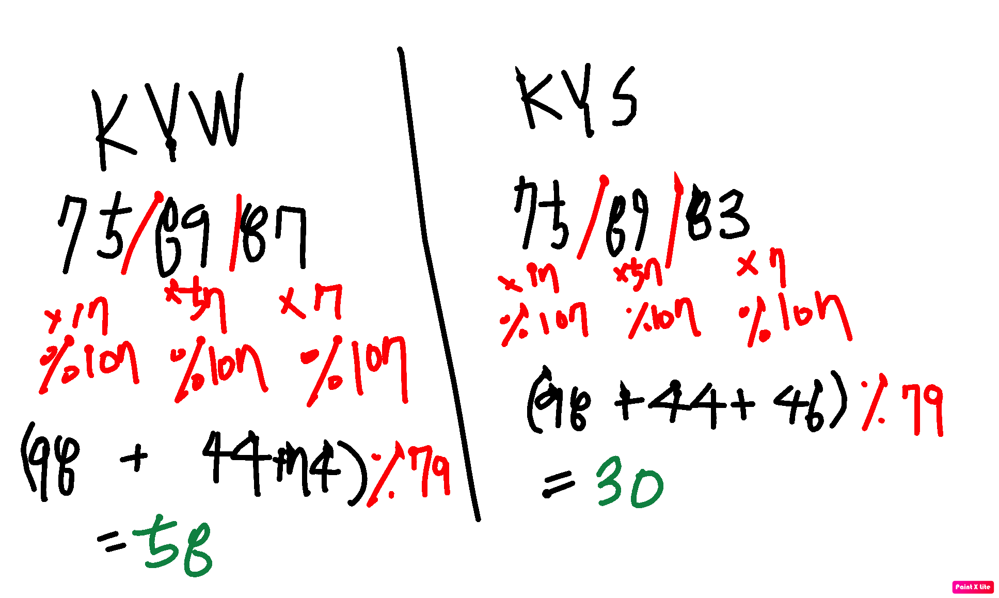
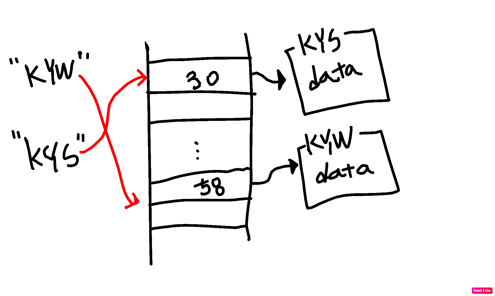

# 알고리즘 1주차 - 해시
- https://programmers.co.kr/learn/courses/30/parts/12077

## 해시 란?
- 단방향 암호화 기법 cf) 양방향 암호화 - 대칭키 암호방식, 공개키 암호방식
- 해시 알고리즘을 이용하여 평문을 암호문으로 변환시킴, 하지만 반대로 암호화된 문장을 평문으로 복구시킬 수 없음.
- 대표적인 해시 알고리즘으로는 SHA-256, SHA-512, MD5 등이 있다.

## 해시 알고리즘 특징
- 비트 하나라도 다르면, 전혀 다른 암호문이 나와야한다.
- 암호문은 같은 수의 비트를 가지게 된다.
- 암호문의 분포도가 높다.
- 암호문으로 평문을 유추할 수 없다.

## 해시 알고리즘 예시

- 58이라는 숫자로 KYW를 유추할 수 없지만, KYW는 언제나 58이라는 숫자로 변환된다.
- KYW와 KYS는 한글자 차이지만 각각 58과 30이라는 전혀 다른 숫자를 출력한다.


## 해시 맵
- 암호문는 같은 수의 비트를 가지게 된다는 특징과 암호문의 분포도가 높다는 특징을 이용한 자료구조.




## 해시 맵 특징
- 탐색속도 O(1), 삭제속도 O(1)
- 정렬 불가 (리스트를 이용하여 정렬)
- 메모리 암호문 비트수 * 노드의 용량


## 자바에서의 해시 맵
``` java
class Person () {
  String name;
  String phoneNumber;
  String job;
  Boolean isMarried;
  // getter & setter
}
```

### 선언
``` java
Map<String, Person> personMap = new HashMap<String, Person>();
```

### 삽입
``` java
Person KYS = new Person();
// get & set
if ( personMap.get(KYS.getName()) == null) {
  personMap.put(KYS.getName(), KYS);
}
```

### 순회
#### Key로 순회
``` java
for (Map.Entry<String, Integer> entry: personMap.entrySet()) {
            String name = entry.getKey();
            Person person = personMap.get(name);
        }
```

#### Value로 순회
``` java
for (Person person: personMap.values()) {

}
```

### 정렬
- LinkedHashMap 사용
``` java
private HashMap<String, Person> sortByValue(HashMap<String, Person> hashMap)
    {
        List<Map.Entry<String, Person> > list
            = new LinkedList<Map.Entry<String, Person> >(
                hashMap.entrySet());
 
        Collections.sort(
            list,
            (i2,
             i1) -> i1.getName().compareTo(i2.getName()));
 
        HashMap<String, Integer> sortedHashMap
            = new LinkedHashMap<String, Person>();
        for (Map.Entry<String, Person> aa : list) {
            sortedHashMap.put(aa.getKey(), aa.getValue());
        }
        
        return sortedHashMap;
    }
```