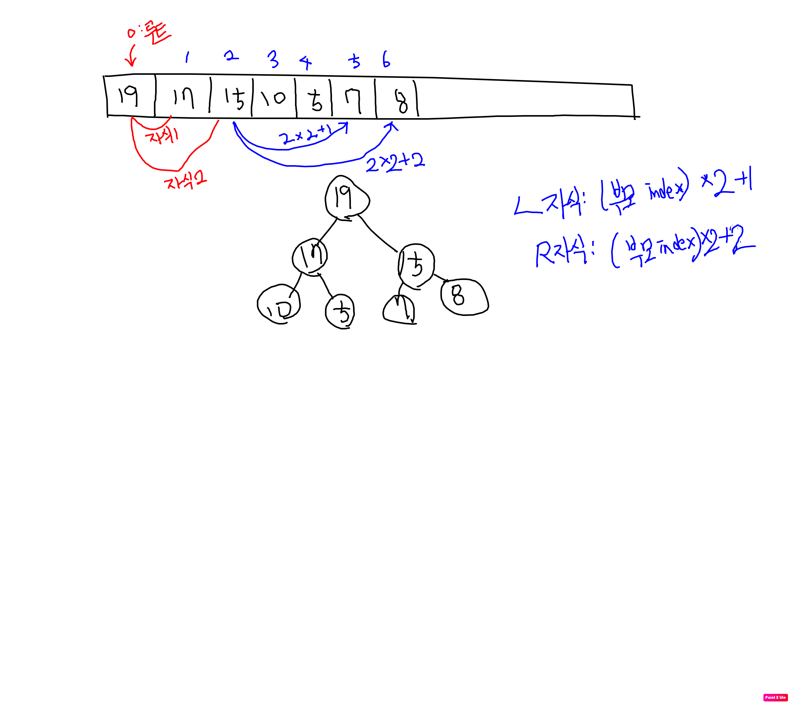
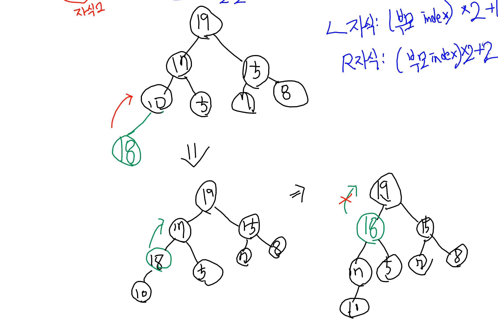
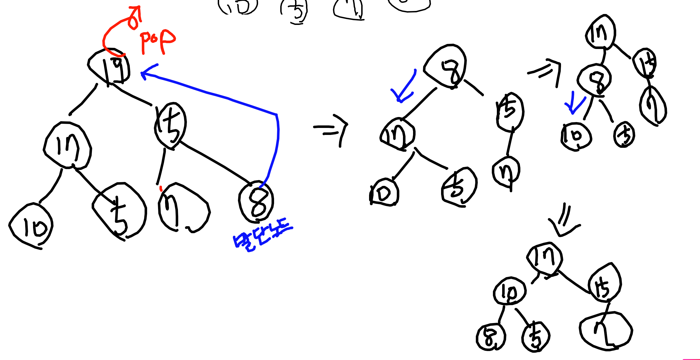

# 알고리즘 3주차 - 힙
> https://programmers.co.kr/learn/courses/30/parts/12117

## 힙이란?
- 가장 높은 값(혹은 낮은 값)을 지속적으로 빠르게 뺄 수 있도록 자료의 삽입과 삭제가 이뤄질 수 있게 고안해낸 자료구조 


- 노드 삽입과 삭제(pop)시 O(nlogn)이 소요. 보통 리스트의 경우 가장 높은 값을 탐색하는데 걸리는 시간은 O(n)

- 우선순위가 높은 자료부터 빼낸다 하여 우선순위 큐 (Priority Queue)라고도 부름

## 힙의 특징
- 완전 이진 트리
- 느슨한 정렬 (최대힙의 경우 부모 노드의 키 > 자식 노드의 키)
- 삭제시 최대 값을 리턴하는지 최소 값을 리턴하는지에 따라 Max Heap, Min Heap으로 구분

## 힙의 구현
1. 배열로 트리 구현하기
2. 삽입 연산
3. 삭제 연산

### 1. 배열로 트리 구현하기
- 최상위 부모 인덱스 : 0
- 왼쪽 자식 인덱스: (부모 인덱스) * 2 + 1
- 오른쪽 자식 인덱스: (부모 인덱스) * 2 + 2


``` java
class MinHeap {
  private ArrayList<Integer> heap;

  public MinHeap() {
    heap = new ArrayList<>();
  }
}
```



### 2. 삽입 연산




### 3. 삭제 연산

1. 루트 노드를 팝한다.
2. 말단 노드를 루트로 옮긴다
3. 말단 노드를 아래 두 자식과 비교해서 자신보다 큰 (작은) 자식과 위치를 바꾼다. ( 자식이 둘 다 크면 더 큰 자식과 바꾼다. )
4. 3번 과정을 진행 할수 없을 때까지 반복한다.




## 힙의 활용
1. 우선순위 큐
2. 힙소트