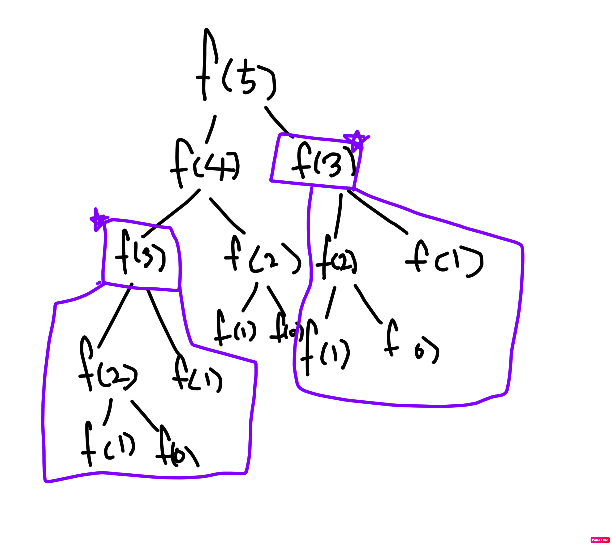
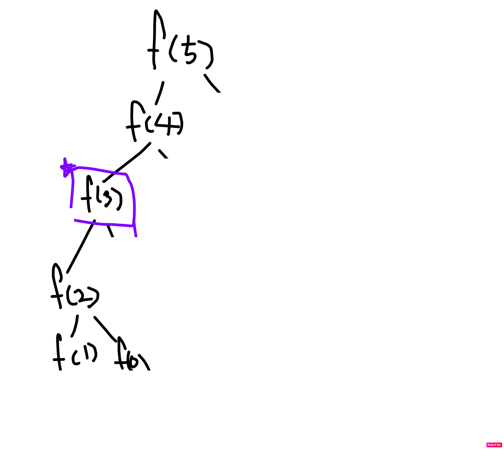

# 알고리즘 6주차 ( 다이나믹 프로그래밍 )

> https://www.acmicpc.net/problem/2747
>
> https://www.acmicpc.net/workbook/view/3959


## 다이나믹 프로그래밍 (Dynamic Programming )이란 ? 

- 완전탐색을 하는 모든 경우의 수에서 한번 가봤던 길을 기억하고 이용하는 방법
- 이러한 이유로 다이나믹 프로그래밍을 Memorialization  기법 이라고 부르기도 함
- f(n) = f(n - k) * m + n 꼴의 점화식을 사용해서 풀이
- 기본 성질을 이용하면 다양한 문제를 만들수 있기때문에, 알고리즘 테스트의 60%을 차지하기도 한다.


## 피보나치 수열

> 첫째 및 둘째 항이 1이며 그 뒤의 모든 항은 바로 앞 두 항의 합인 수열


### 재귀함수를 이용한 피보나치

``` java
public int fibo(n) {
  if (n < 2) return n;
  return fibo(n - 1) + fibo(n - 2);
}
```



#### 시간복잡도 

- O(2^n)


### 다이나믹 프로그래밍을 이용한 피보나치

- 위의 그림을 보면 f(3) 은 f(2) 와 f(1)로 똑같이 만들어지는 연산을 두번하게 된다.
- 처음 f(3)을 만나면 이를 기억 해놓았다가, 다음에 만날 때 꺼내 쓰도록 구조 변경


#### 점화식

> f(n) = f(n - 1) + f(n - 2)


``` java
private int[] dp = new int[1000001];
public int fibo(int n) {
  if (n < 2) return n;
  if (dp[n] != 0)  {
    dp[n] = fibo(n - 1) + f(n - 2);
  }
  
  return dp[n]
}
```



#### 시간복잡도 

- O(n)